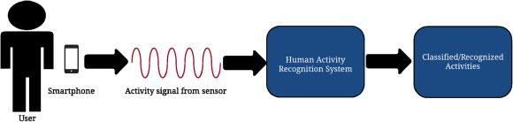
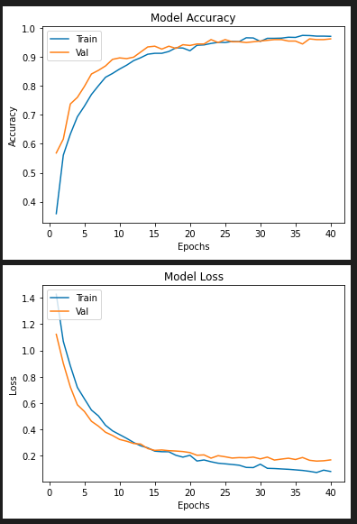
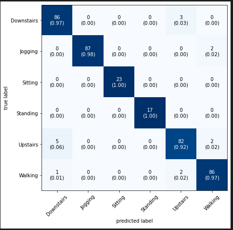

<!--
*** Thanks for checking out the Best-README-Template. If you have a suggestion
*** that would make this better, please fork the repo and create a pull request
*** or simply open an issue with the tag "enhancement".
*** Thanks again! Now go create something AMAZING! :D
-->

<!-- PROJECT SHIELDS -->
<!--
*** I'm using markdown "reference style" links for readability.
*** Reference links are enclosed in brackets [ ] instead of parentheses ( ).
*** See the bottom of this document for the declaration of the reference variables
*** for contributors-url, forks-url, etc. This is an optional, concise syntax you may use.
*** https://www.markdownguide.org/basic-syntax/#reference-style-links
-->
[![Contributors][contributors-shield]][contributors-url]
[![Forks][forks-shield]][forks-url]
[![Stargazers][stars-shield]][stars-url]

<!-- PROJECT LOGO -->
 

    
  </a>

  <h2 align="center">Human Activity Recognition</h2>

  

    Classifying Your Daily Activities
     
    

<!-- TABLE OF CONTENTS -->

  
Table of Contents

  <ol>
    <li>
      <a href="#about-the-project">About The Project</a>
      <ul>
        <li><a href="#built-with">Built With</a></li>
      </ul>
    </li>
    <li><a href="#Activities Classified">Activities Classified</a></li>
    <li><a href="#Model Architecture">Model Architecture</a></li>
    <li><a href="#Results">Results</a></li>
    <li><a href="#contributing">Contributing</a></li>
    <li><a href="#acknowledgements">Acknowledgements</a></li>
  </ol>

<!-- ABOUT THE PROJECT -->
## About The Project

Activity recognition is an important area in the field of research.With the
advent of IoT ,real-life sensing applications are becoming available.These
applications use sensory data from various devices to recognize human
activities ,in order to get a better understanding of human behaviour and
scheduled activities.

My Model Architecture:
* I have re-implemented the ConvLSTM approach to harness the spatio-temporal behavior of our data.
* The model has been built upon implementing both CNN and LSTM and comparing it's performance with the final model.

A list of commonly used resources that I find helpful are listed in the acknowledgements.

### Built With
The Framework used is-
* [Tensorflow](https://www.tensorflow.org/)

<!-- GETTING STARTED -->
### Activities Classified

* Downstairs
* Jogging
* Sitting
* Standing
* Upstairs
* Walking

### Prerequisites

I would recommend the user to have a base understanding of the following before the implementing the project-

* CNN
* Vanilla RNN,LSTM's And GRU's
* Grok the intution behind the usage of ConvLSTM's 

<!-- USAGE EXAMPLES -->
## Model Architecture

**Dataset**-[Acti-Tracker Dataset(WISDM LABS)](https://www.cis.fordham.edu/wisdm/dataset.php)

**Frame Preparation**-

* Frequency = 20mHz (dataset specific)
* Frame size = 4*frequency
* Hop Size = 2*frequency (50% overlap)

<h2>Model 1-The CNN Based Approach</h2>
The approach in the following paper has been re-implemented in this modeule.The paper was re-implemented by me as a part of my 5th sem minor-project.

This paper focusses on the spatial information of our data and can understood as a basic CNN network for images which use acclerometer readings,in place of RGB pixels.

Read this Paper for more info.[Convolutional Neural Networks for Human Activity Recognition using Mobile
Sensors](https://www.researchgate.net/publication/279450375_Convolutional_Neural_Networks_for_Human_Activity_Recognition_using_Mobile_Sensors)

*Implementation-Refer Module CNNmodel and CNN_engine*

<h2>Model 2-The LSTM Based Approach</h2>
This module focusses on the temporal information extracted from our data and is able to model long-term dependencies pretty accurately.

However,we can leverage both spatial and temporal properties of our data with a ConvLSTM.

*Implementation-Refer Module LSTMmodel and LSTM_engine*

<h2>Model 3-The ConvLSTM Approach</h2>

I re-implemented the paper.[Convolutional LSTM Network: A Machine Learning Approach for Precipitation Nowcasting](https://arxiv.org/abs/1506.04214v1) as sequence classification problem in my use case.

**Model Basics**-Unlike an LSTM that reads the data in directly in order to calculate internal state and state transitions, and unlike the CNN LSTM that is interpreting the output from CNN models, the ConvLSTM is using convolutions directly as part of reading input into the LSTM units themselves.

Input_Format-\
The  Data was presented as 4 frames each of 20 window size in the 3 accelerometeric axes.(4,20,3)

*Implementation-refer Module ConvLSTM and ConvLSTM_engine*

<!-- Results -->
## Results

The best results were shown by the ConvLSTM model.The model showed a low bias and low varaince tendency.The results are as follows-

    Model Accuracy and Model Loss
    

      Activities Classififcation Matrix
      

<!-- CONTRIBUTING -->
## Contributing

Contributions are what make the open source community such an amazing place to be learn, inspire, and create. Any contributions you make are **greatly appreciated**.

1. Fork the Project
2. Create your Feature Branch (`git checkout -b feature/AmazingFeature`)
3. Commit your Changes (`git commit -m 'Add some AmazingFeature'`)
4. Push to the Branch (`git push origin feature/AmazingFeature`)
5. Open a Pull Request

<!-- ACKNOWLEDGEMENTS -->
## Acknowledgements
* [Convolutional Neural Networks for Human Activity Recognition using MobileSensors](https://www.researchgate.net/publication/279450375_Convolutional_Neural_Networks_for_Human_Activity_Recognition_using_Mobile_Sensors)
* [Convolutional LSTM Network: A Machine Learning Approach for Precipitation Nowcasting](https://arxiv.org/abs/1506.04214v1)
* [Mr. LaxmiKant Tiwari](https://www.youtube.com/channel/UCTiWgVtEGSY4cuduJbMPblA)
* [Machine Learning Mastery](https://machinelearningmastery.com/)
* [KDnuggets](https://www.kdnuggets.com/)

<!-- MARKDOWN LINKS & IMAGES -->
<!-- https://www.markdownguide.org/basic-syntax/#reference-style-links -->
[contributors-shield]: https://img.shields.io/github/contributors/othneildrew/Best-README-Template.svg?style=for-the-badge
[contributors-url]: https://github.com/othneildrew/Best-README-Template/graphs/contributors
[forks-shield]: https://img.shields.io/github/forks/othneildrew/Best-README-Template.svg?style=for-the-badge
[forks-url]: https://github.com/othneildrew/Best-README-Template/network/members
[stars-shield]: https://img.shields.io/github/stars/othneildrew/Best-README-Template.svg?style=for-the-badge
[stars-url]: https://github.com/othneildrew/Best-README-Template/stargazers
[issues-shield]: https://img.shields.io/github/issues/othneildrew/Best-README-Template.svg?style=for-the-badge
[issues-url]: https://github.com/othneildrew/Best-README-Template/issues
[license-shield]: https://img.shields.io/github/license/othneildrew/Best-README-Template.svg?style=for-the-badge
[license-url]: https://github.com/othneildrew/Best-README-Template/blob/master/LICENSE.txt
[linkedin-shield]: https://img.shields.io/badge/-LinkedIn-black.svg?style=for-the-badge&logo=linkedin&colorB=555
[linkedin-url]: https://linkedin.com/in/othneildrew
[product-screenshot]: images/screenshot.png
